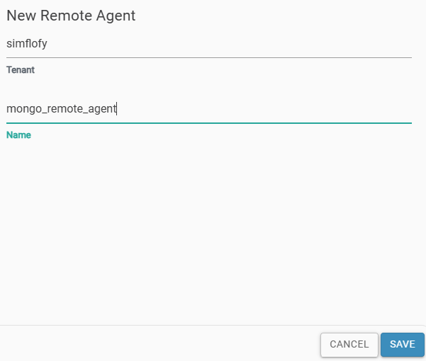
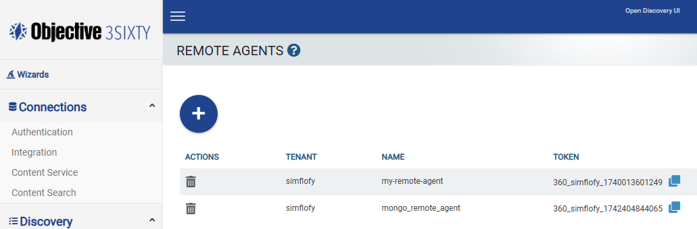

# MongoDB Custom Connector (Remote Agent) Example (WORK IN PROGRESS)

This is an example of a MongoDB custom connector (Remote Agent) that can be used with your 3Sixty platform. This guide shows how you can leverage
the [SDK](https://central.sonatype.com/artifact/com.objective.threesixty/threesixty-sdk)
to build a 3Sixty custom connector to connect to your custom repository.

The following is a detailed, step-by-step guide on how to create, register, and configure your remote agent. 
By following this guide, you can ensure a smooth setup and deployment of your custom connectors.

This guide will walk you through:
- Setting up your development environment.

- Building your own custom connector.

- Deploying your remote agent.

- Registering your remote agent with your 3Sixty platform.

## How It Works
You will deploy agents that communicate with your legacy, proprietary, or homegrown applications. These agents will manage the transfer of binaries and metadata from your repository. For each deployed agent, a corresponding agent must be created in the 3Sixty platform.

For example, if you have multiple repositories that you want to connect using the custom framework, you need to register corresponding agents in 3Sixty for each custom connector. Each agent is deployed as a separate Spring application.

Once your remote agent is up and running, it will securely establish a connection with the 3Sixty server. Upon connection, it operates like any other out-of-the-box connector supported by 3Sixty, leveraging all available tasks and functionalities on the 3Sixty platform.

## Prerequisites
Our Remote Agent SDK is built using Java, so you'll need Java 17+ to build a custom connector. Additionally, the Spring framework is required for constructing your custom connector. You can use any IDE you prefer to build the custom connector with our SDK.
- [Java 17+](https://docs.aws.amazon.com/corretto/latest/corretto-17-ug/downloads-list.html): Ensure you have Java 17 or higher installed.

- [Spring Framework](https://spring.io/projects/spring-framework#overview): Required for building your custom connector.

- [IDE](https://www.jetbrains.com/idea/): Use your preferred Integrated Development Environment (IDE).

- [Maven 3.8+](https://maven.apache.org/docs/3.8.6/release-notes.html): Required for dependency management and building your project.

- [SDK Availability](https://central.sonatype.com/artifact/com.objective.threesixty/threesixty-sdk): The SDK project is available on Maven Central and can be referenced directly in your POM file.

- [Remote Agent Example Project](https://github.com/Objective-Corporation/3Sixty-SDK-Samples): The remote-agent-example project is an Example of a Remote Agent. It shows how to use the SDK to connect with the 3Sixty Server. Use this project as a referece

## Getting started
1. Configure the two properties in global properties, and also follow Configuring SSL if applicable
    - 3sixty.grpc.server.port=`<PORT>`

    - 3sixty.grpc.server.start=`true`

2. Go to the 3Sixty UI, generate the remote agent token. [Example](#creating-a-remote-agent-token)

3. Create an integration connection in 3Sixty. [Example](#create-an-integration-connection)

4. Create a Spring Maven application. 

5. Add our SDK as dependency in your pom.xml. [Example](#configuring-the-implementation-project)

6. Add the token and agent name (generated in step 2), to your Spring properties files. See step 2 in [Configuring the Implementation Project](#configuring-the-implementation-project)

7. Configure the connector. Read the readme to understand how to configure the connector. [Example](#configuring-the-connector)

8. Implement RepositoryReader and RepositoryWriter interfaces of SDK. For reference see the FileSystemReader and FileSystemWriter.

9. Run the application in Maven. When you run your application, it will connect with 3Sixty-server. [Example](#running-the-remote-agent)

10. Return to the 3SixtyUI and create a job. [Example](#create-a-job)

## Creating a Remote Agent Token

### Step 1: Create an Agent:

1. Log into 3Sixty and navigate to `Admin -> Remote Agents`
   This Remote Agents page will list any existing Agents.

*Image 1: 3Sixty Remote Agent List*


2. Select the `blue plus` button to open the New Remote agent form
3. Enter the Agent name, and select `save`

*Image 2: Create New Remote Agent*



4. On the Remote Agent List you will see the new remote agent with the `token` generated by 3Sixty
5. Click the copy icon to copy the `token` and paste it into the `remote-agent.token:` field in the *application.yaml* file. See Step 2
   in [How to Use the SDK](#how-to-use-the-sdk)

*Image 3: New Remote Agent with Token*



## Create an Integration Connection

1. Go to `Connections -> Integration` in the left navigation menu
2. Click on the `blue plus` sign to create a new integration connection
3. Select `Remote Agent Connector` from the Connection Type dropdown
4. Click `Save` to create the new connection

*Image 4: New Remote Agent Integration Connection*


5. On the `Edit Connection` page select the Agent you created in [Step 1](#step-1-create-an-agent) from the Remote Agent
   dropdown
6. Click Save

*Image 5: Edit New Integration Connection*


## Configuring the Implementation Project

1. Add the SDK as a Maven dependency in your project.

```     
      <dependency>
          <groupId>com.objective.threesixty</groupId>
          <artifactId>threesixty-sdk</artifactId>
          <version>1.0.2</version>
      </dependency> 
```

2. Add the below configuration in the *application.yaml* file.

- `server:`
    - `port:` Port of the 3Sixty server

- `remote-agent:`
    - `token:` This is the API token that is generated in the 3Sixty server.
      See [Creating an Agent Token](#step-1-create-an-agent)
    - `agent-name:` Name of the agent
    - `grpc-server:`
        - `host:` Host address of the 3Sixty server
        - `port:` Port of the 3Sixty gRPC server
        - `timeouts:`
            - `configure-connector-form-rpc:` Maximum wait time for saving job configurations
            - `share-document-metadata-rpc:` Maximum wait time for sending a single document's metadata
            - `share-documents-rpc:` Maximum wait time for sending the list of documents from the repository
            - `share-document-rpc:` Maximum wait time for sending a document from the repository
            - `send-deletion-response-rpc:` Maximum wait time for deleting a document from the repository
            - `validate-agent-token-rpc:` Maximum wait time for validating remote agent tokens
            - `write-document-request-rpc`: Maximum wait time for the remote agent to send the written document details back to 3Sixty
            - `get-extended-document-rpc`: Maximum wait time for the remote agent to get the document and its metadata from cached document from the source repository
    - `server-url:` REST URL to connect with the 3Sixty server, including the protocol
    - `ssl-config:`
        - `ca-certs:`
            - `password:` Password to the certificate authority
        - `enabled:` `false` to use plaintext, or `true` to use SSL

Contact the 3Sixty team to get the host, port and url.

3. In your application, scan for SDK beans and components. You can do this by using the `@ComponentScan` annotation in
   your Main class.
    - See the *Application.java* file for reference.
4. Implement the SDK's *ConnectorForm.java* interface.
    - See the *FileSystemConnectorForm.java* for reference.
5. Then implement the SDK'S *RepositoryReader.java* interface.
    - See the *FileSystemReader.java* for reference.
6. Also implement the SDK's *RepositoryWriter.java* interface
    - See the *FileSystemWriter.java* for reference

## Configuring the Connector

In the implementation of the `ConnectorForm.java` interface, you can configure the configuration as below

```    
@Override
public List<Field> getSourceRepositoryFields() {
    // File Path
    Field filePath = Field.newBuilder()
            .setLabel("File Path")
            .setId("filePath")
            .setTextField(TextField.newBuilder().build())
            .build();
    return List.of(filePath);
}

@Override
public List<Field> getOutputRepositoryFields() {
    // File Path
    Field filePath = Field.newBuilder()
        .setLabel("Output File Path")
        .setId("filePath")
        .setTextField(TextField.newBuilder().build())
        .build();
    return List.of(filePath);
}
    
@Override
public List<Field> getContentServiceFields() {
    //Custom Fields
    Field toggleCheckbox = Field.newBuilder()
            .setLabel("Show/Hide Text field")
            .setDescription("Toggles Text field")
            .setId("toggleCheckbox")
            .setCheckboxField(CheckboxField.newBuilder().setValue(false).build())
            .build();
    Field textField = Field.newBuilder()
            .setLabel("Text field")
            .setId("textField")
            .setDependsOn(toggleCheckbox.getId())
            .setTextField(TextField.newBuilder().build())
            .build();
    return List.of(toggleCheckbox, textField);
}
```

In the above code, we are configuring a **Text Field** to create a File Path in 3Sixty Server for both the source, and output job repositories. 
We are also adding a pair of fields to the Content Service custom fields. The first field creates a checkbox. The second creates a 
string field that can be shown/hidden using the checkbox.

## Running the Remote Agent

### Steps to Build and Run

1. Clone this project
2. Update the *application.yaml* as mentioned in [How to use the SDK](#how-to-use-the-sdk)
3. Open the project in any supported IDE (For example: IntelliJ IDEA, Eclipse etc.) and run the project from the IDE
4. If you do not have an IDE, run the following commands to create the JAR file:
   ```bash
   mvn clean
   mvn package

Then you can run the jar file using the command prompt `java –jar remote-agent-example.jar`

### Create a Content Service Connection
This step is needed when you are running a Manage In Place job.
1. Go to `Connections -> Content Service` in the left navigation menu.
2. Click on the `blue plus` sign to create a new Content Service connection.
3. In the `Type` dropdown, select `Remote Agent Content Service Connector`.

   In the Remote Agent Content Service Connector dropdown, select your Remote Agent.
4. If you have any parameters for your Content Service implementation, you can add them in the `Connection Configuration` tab.

   Select `Add Custom Parameter` to add extra parameters on top of the fields which you may have set up in your `ConnectorForm` implementation.

   These parameters can be accessed as `CustomParameters` in the remote agent SDK.
5. Save the Content Service Connection.

   Now you can select the content service in your Manage In Place job.


## Create a Job

After the token is generated, you can run the Remote Agent with the token to establish a connection with the Server.
Refer to the [Build and Run](#steps-to-build-and-run) section for instructions on how to run the remote agent.
Once the Remote Agent is running, you can begin creating Jobs.
In this example we will be moving files from the Remote Agent connector to a File System folder.

1. Go to `Integration -> List Jobs` on the navigation menu
2. Click the Blue Plus button to create a new job
3. View the Edit Job Page
4. Select the Integration Connection `Remote Agent Test Integration` you created
   in [Step 2](#step-2-create-an-integration-connection)
5. Select `File System` for the Output Connection

*Image 6: Create an Example Job*


6. Go to the Remote Agent Configuration Tab and enter the File Path configuration that you configured in your Agent

*Image 7: File Path Configuration*


7. Go to the File System Configuration tab and enter the destination File System directory

8. Go to `Integration -> Run and Monitor Jobs`
9. Locate your integration job and select run. You can use the search field to filter for the job name

3Sixty will copy the files from your Remote Agent to your file system directory

*Image 8: Run New Remote Agent Job*


## Configuring SSL for Tomcat REST server

If your Tomcat application (`serverUrl`) is configured to use SSL (as specified in Tomcat's *server.xml* and indicated by the HTTPS protocol), then you will need to export the root CA certificate from the Tomcat keystore and into the truststore in *%JAVA_HOME%\lib\security\cacerts*.

## Configuring SSL for gRPC server

By default, SSL is enabled on the gRPC server. So, if you need to run without SSL, set the
`3sixty.grpc.server.ssl` property to `false` in the 3Sixty application.

Then, in the *application.yaml*, set `remote-agent.ssl-config.enabled` to false.

### cacerts

If you have JAVA in your machine, *cacerts* will already be there. All of our certificates will be in *cacerts*.
You can import the certificate in *cacerts* using the command line or using GUI.
We recommend using Keystore Explorer (https://keystore-explorer.org). Keystone Explorer should open as below.


From the above screen, select `Open the CA Certificate KeyStore`, It should show all the certificates in *cacerts*.

### Configuring Certificate in the gRPC Server

Ideally, the client should get the certificate from the Certificate Authority. In the server, you will need two files to
enable SSL.

1. Server Certificate
2. Server Private Key

Both of them should be in .pem format (for example, *server-cert.pem* and *server-key.pem*).

#### gRPC Server Certificate

1. *cacerts* password should be the same as the property `3sixty.grpc.server.cacerts.password`. By default, the value
   is `changeit`.
   If your *cacerts* password is different, update this property.
2. Import your server certificate in *cacerts* and alias it with the value in the
   property`3sixty.grpc.server.cacerts.cert.alias`.
   By Default its value is `grpc-objective-server`. You can alias the certificate with the default value unless you
   changed the property.

#### gRPC Server Private Key

- The private key should be in `.pem` format, and should be named as `server-key.pem`.
- Create a `cert` folder in the Tomcat `webapps` directory and copy the `server-key.pem` file into
  `{catalina.home}/webapps/cert/server-key.pem`, where `catalina.home` refers to the Tomcat home directory.

### Configuring gRPC Certificate in the Client

1. *cacerts* password should be same as property `remote-agent.ssl-config.ca-certs.password`. By default, its value
   is `changeit`.
   If your *cacerts* password is different, update this property.
2. Import the client certificate in *cacerts* and alias it with any suitable name.

## License

MIT License.
