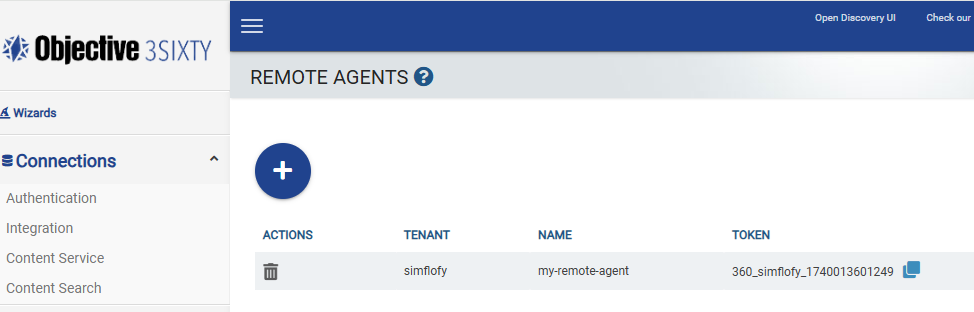
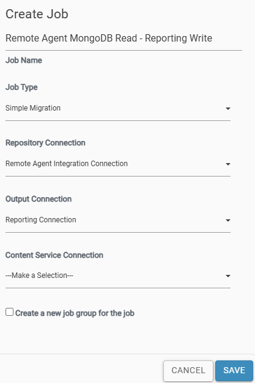
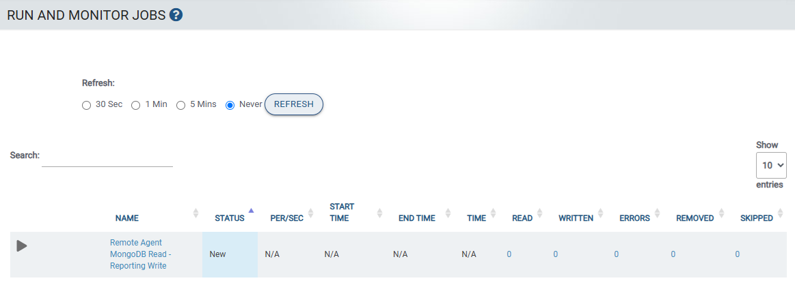

# MongoDB Custom Connector (Remote Agent) 


3Sixty's Custom Connector SDK empowers users to create bespoke connectors, enabling seamless 
integration with remote, custom repositories. With this SDK, you can discover, transfer, and 
manage content and metadata from various sources, just like our natively supported connectors. 
Once connected, these custom connectors offer full access to 3Sixty platform features such as
document enrichment, search, and transfer, ensuring a consistent and robust experience. 
Designed for security and flexibility, this framework extends our capabilities to reach 
isolated information silos, including home-grown, legacy, or proprietary systems.

## How It Works
You will deploy agents that communicate with your legacy, proprietary, or homegrown applications. These agents will manage the transfer of binaries and metadata from your repository. For each deployed agent, a corresponding agent must be created in the 3Sixty platform.

For example, if you have multiple repositories that you want to connect using the custom framework, you need to register corresponding agents in 3Sixty for each custom connector. Each agent is deployed as a separate Spring Boot application.

Once your remote agent is up and running, it will securely establish a connection with the 3Sixty server. Upon connection, it operates like any other out-of-the-box connector supported by 3Sixty, leveraging all available tasks and functionalities on the 3Sixty platform.

## Getting Started
This guide is broken into the following 3 sections:

I. [How to Use a Custom Connector](#i-how-to-use-a-custom-connector)

II. [How to implement your own Custom Connector](#ii-how-to-implement-your-own-custom-connector)

III. [Setting up SSL between Custom Connector and 3Sixty](#iii-setting-up-ssl-between-custom-connector-and-3sixty)

## I. How to Use a Custom Connector
1. [Enable the gRPC server on 3Sixty Server](#1-enable-the-grpc-server-on-3sixty-server).
2. [Generate a Remote Agent Token](#2-generate-a-remote-agent-token). 
3. [Create an Integration Connection](#3-create-an-integration-connection).
4. [Configure and Start the Custom Connector](#4-configure-and-start-the-remote-agent).
5. [Create and Run a Job](#5-create-and-run-a-job).

### 1. Enable the gRPC server on 3Sixty Server
From the 3Sixty Server, locate the *simflofy-global.properties* file in your Apache Tomcat directory.

> [!NOTE]
> The *simflofy-global.properties* file can be found in one of 2 locations:
> 1. *<CATALINA_HOME>\webapps\3sixty-admin\WEB-INF\classes* or,
> 2. *<CATALINA_HOME>\shared\classes* (This is applicable if shared loader is used.)
> 

Locate the gRPC section:
```
#Start the server used to receive messages from Remote Agents
3sixty.grpc.server.port=50052
3sixty.grpc.server.start=true
3sixty.grpc.server.ssl=false
3sixty.grpc.server.cacerts.password=changeit
3sixty.grpc.server.cacerts.cert.alias=grpc-objective-server
3sixty.grpc.server.readbinary.timeout.minutes=60
```
Make sure that ***3sixty.grpc.server.start*** is set to **true**.  Restart 3Sixty after 
making any modifications to the *simflofy-global.properties* file.

### 2. Generate a Remote Agent Token
1. Log into 3Sixty and navigate to `Admin -> Remote Agents` from the left navigation menu.
   The Remote Agents page will show all existing remote agents.



2. Select the round blue "`+`" button to create a new Remote Agent.
3. Enter a Tenant (or use the default) and a Name for the Remote Agent, and select `SAVE`


4. You will see the new remote agent with a token generated by 3Sixty.
5. You will need the value of this generated token in a later step when you configure your
custom connector's *application.yaml* file.


### 3. Create an Integration Connection

1. Navigate to `Connections -> Integration` from the left navigation menu.
The Integration Connections page will show all existing integration connections.
2. Click on the round blue "`+`" button to create a new Integration Connection.
3. Enter a Connection Name and a Connection Description (optional).
4. Select `Remote Agent Connector` from the Connection Type dropdown.
5. Click `SAVE` to create the new connection.


6. On the `EDIT CONNECTION` page select the Remote Agent you created in the previous step from the Remote Agent
   dropdown.
7. Click `SAVE` to complete the creation.


### 4. Configure and Start the Remote Agent

#### Steps to Build and Run

1. Clone this project.
2. Update the *application.yaml* file with the name of the remote agent
and token value that you created in [Step 2](#2-generate-a-remote-agent-token).  This file is located in the */src/main/resources* 
directory in the project folder.
   

```plaintext
server:
    port: 8082 <port used by the custom connector>
   
remote-agent:
    token: 360_simflofy_1742404844065 <token generated by the 3Sixty server>
    agent-name: mongo_remote_agent <name of the remote agent>
    grpc-server:
        host: localhost <host address of the 3Sixty server>
        port: 50052 <port of the 3Sixty gRPC server>
        timeouts:
            configure-connector-form-rpc: 120 <maximum wait time for saving job configurations>
            share-document-metadata-rpc: 30 <maximum wait time for sending a single document's metadata>
            share-documents-rpc: 300 <maximum wait time for sending the list of documents from the repository>
            share-document-rpc: 60 <maximum wait time for sending a document from the repository>
            send-deletion-response-rpc: 60 <maximum wait time for deleting a document from the repository>
            validate-agent-token-rpc: 60 <maximum wait time for validating remote agent tokens>
            write-document-request-rpc: 30 <maximum wait time for the remote agent to send the written document details back to 3Sixty>
            get-extended-document-rpc: 30 <maximum wait time for the remote agent to get the document and its metadata from cached document from the source repository>
    server-url: http://localhost:8080/3sixty-admin <REST URL to connect with the 3Sixty server, including the protocol>
    ssl-config:
        ca-certs:
            password: changeit <password to the cacerts keystore file>
        enabled: false <set to true if using SSL>

logging:
  level:
    com.objective.threesixty:
      remoteagent.sdk: INFO <set log level for the SDK>
      agent: INFO <set log level for the remote agent>
```

3. Open cloned project in any IDE that supports Java development (e.g. IntelliJ IDEA,
Eclipse, etc.) and run the project directly from your IDE.
4. If not using an IDE, you can also package the JAR file using the following Maven commands: 
   ```shellscript
   mvn clean
   mvn package

Then you can run the JAR file from the command prompt:
```powershell
java –jar remote-agent-example-exec.jar
```
> [!NOTE]
> Please review the [Prerequisites](#1-prerequisites) section for Maven and Java requirements.

### 5. Create and Run a Job
Once the Remote Agent is running, you can begin creating Jobs. 
For this example, we will be moving documents from MongoDB using the custom connector to a
Reporting connector.

1. Select `Integration -> List Jobs` from the left navigation menu.
2. Click the round blue "`+`" button to create a new job.
3. Enter a Job Name and select a Job Type.
4. For the Repository Connection, select the Integration Connection `Remote Agent 
Integration Connection` you created in [Step 3](#3-create-an-integration-connection).
5. For the Output Connection, select `Reporting Connection`.



6. Click `SAVE` to complete the creation of the new Job.
7. Go to the Remote Agent Configuration Tab and enter the File Path configuration that you configured in your Agent


7. Go to the File System Configuration tab and enter the destination File System directory

8. Go to `Integration -> Run and Monitor Jobs`
9. Locate your integration job and select `run`. You can use the search
field to filter for the job name.

3Sixty will read the documents from your MongoDB and display 
the documents processed.



## II. How to implement your own Custom Connector
1. [Prerequisites](#1-prerequisites).
2. [Review Code from Sample Project](#2-review-code-from-sample-project).
3. [Implement Java Interfaces](#3-implement-java-interfaces).


### 1. Prerequisites
Our Remote Agent SDK is built on Java, so you'll need Java 17+ to develop a custom connector. 
Additionally, the Spring Boot framework is required for constructing your custom connector. 
You can use any IDE you prefer to build the custom connector with our SDK.

- Integrated Development Environment (IDE): Use any IDE that supports Java development,
  such as [JetBrains IntelliJ IDEA](https://www.jetbrains.com/idea/).

- [Java 17+](https://docs.aws.amazon.com/corretto/latest/corretto-17-ug/downloads-list.html): Ensure you have Java 17 or higher installed.

- [Spring Boot Framework](https://spring.io/projects/spring-boot): Required for building your custom connector.

- [Maven 3.8+](https://maven.apache.org/docs/3.8.6/release-notes.html): Required for dependency management and for building your project.

- [Objective SDK](https://central.sonatype.com/artifact/com.objective.threesixty/threesixty-sdk): The SDK project is available on Maven Central and can be referenced directly in your POM file.

### 2. Review Code from Sample Project
Review the project code from the  [Remote Agent Example Project](https://github.com/Objective-Corporation/3sixty-mongo-remoteagent): This project is an example of a
  Remote Agent. It shows how to use the SDK to connect with the 3Sixty Server.
  Use this project as a reference.

### 3. Implement Java Interfaces
1. In your application, scan for SDK beans and components. You can do this by using the `@ComponentScan` annotation in
   your Main class.
    - See the *Application.java* file for reference.
2. Implement the *ConnectorForm.java* interface.
    - See the *MongoDBConnectorForm.java* for reference.
3. Implement the *RepositoryReader.java* interface.
    - See the *MongoDBReader.java* for reference.
4. Implement the *RepositoryWriter.java* interface.
    - See the *MongoDBWriter.java* for reference.

## III. Setting up SSL between Custom Connector and 3Sixty

If your Tomcat application is configured to use SSL (as specified in
Tomcat's *server.xml* and indicated by the HTTPS protocol), then you
will need to export the root CA certificate from the Tomcat keystore
into the truststore in *%JAVA_HOME%\lib\security\cacerts*.

### Configuring SSL for gRPC server

By default, SSL is enabled on the gRPC server. So, if you need to run
without SSL, set the `3sixty.grpc.server.ssl` property to `false` 
in the 3Sixty application.

Then, in the *application.yaml*, set `remote-agent.ssl-config.enabled` 
to false.

### Import Certificate into cacerts

If you have JAVA in your machine, *cacerts* will already be there. 
All of our certificates will be in *cacerts*.
You can import the certificate in *cacerts* using the command line or
using GUI.
We recommend using Keystore Explorer (https://keystore-explorer.org). 
Keystone Explorer should open as below.


From the above screen, select `Open the CA Certificate KeyStore`,
It should show all the certificates in *cacerts*.

### Configuring Certificate in the gRPC Server

Ideally, the client should get the certificate from the Certificate 
Authority. In the server, you will need two files to enable SSL.

1. Server Certificate
2. Server Private Key

Both of them should be in `.pem` format (for example, 
*server-cert.pem* and *server-key.pem*).

#### gRPC Server Certificate

1. *cacerts* password should be the same as the property `3sixty.grpc.server.cacerts.password`. By default, the value
   is `changeit`.
   If your *cacerts* password is different, update this property.
2. Import your server certificate in *cacerts* and alias it with the value in the
   property`3sixty.grpc.server.cacerts.cert.alias`.
   By Default its value is `grpc-objective-server`. You can alias the certificate with the default value unless you
   changed the property.

#### gRPC Server Private Key

- The private key should be in `.pem` format, and should be named as
`server-key.pem`.
- Create a `cert` folder in the Tomcat `webapps` directory and copy
the `server-key.pem` file into
  `<CATALINA_HOME>/webapps/cert/server-key.pem`, where 
`<CATALINA_HOME>` refers to the Tomcat home directory.

### Configuring gRPC Certificate in the Client

1. *cacerts* password should be same as property 
`remote-agent.ssl-config.ca-certs.password`. By default, its value
   is `changeit`.
   If your *cacerts* password is different, update this property.
2. Import the client certificate in *cacerts* and alias it with any suitable name.

## License

MIT License.
